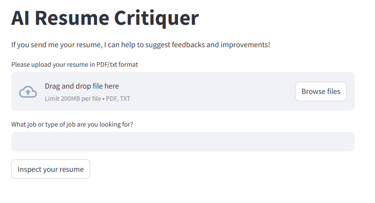
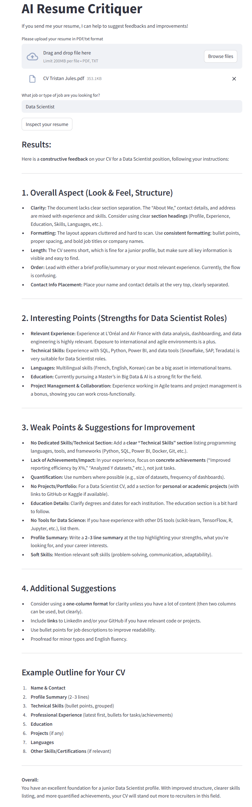
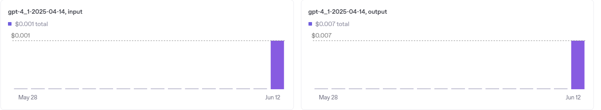
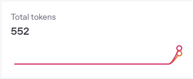

# CV-Critiquer powered by LLM (OpenAI API)

In this project, we are building a local web app that will help the user to improve a resume.

Stack of the project: uv, Python, Streamlit, OpenAI API.


## **Table of contents**

* [1 - Install UV](#1---install-uv)
* [2 - Create and configurate the project](#2---create-and-configurate-the-project)
* [3 - Results using this program](#3---results-using-this-program)
* [4 - OpenAI Resources used](#4---openai-resources-used)

### 1 - Install UV

Using [UV](https://docs.astral.sh/uv/getting-started/installation/) instead of PiP as a packet manager.  
It is more optimized (less time to download libraries) and effective for this project.

### 2 - Create and configurate the project

```sh
uv init # Initialize new project in the current folder
uv add openai streamlit PyPDF2 python-dotenv # Import the packages we will work with
```

We will need the OpenAI API, which we access through a key that we get [on OpenAI API website](https://platform.openai.com/api-keys)  
In my case, I registered the OpenAI API Key in a .env file and imported it in my main module.

**Make sure to the key in a .env file and put that .env file in the .gitignore so that your API Key is not revealed upon commit on Github.**

These commands will iniate a UV project in the current folder and download the 4 following libraries:

- openai: Access to the latest LLMs like GPT-4.1 through OpenAI API.
- streamlit: Allow us to create a web app using a Python Script.
- PyPDF2: Useful package to deal with pdf files inside Python.
- python-dotenv: Used to keep APIs and sensitive data away from the main file.

Now to run the project:

```sh
uv run streamlit run main.py
```

This will generate a localhost web app:



I upload my personal resume on the program and I write down the job I'm looking for.


### 3 - Results using this program

The response we get from the LLM is quite accurate and helpful.  
It would definitely be a nice tool to get feedbacks on our CV regarding a specific job or industry.



### 4 - OpenAI Resources used

I also wanted to show the resources used by the program by checking the storage data available on OpenAI API website.  





In the code, I asked for a maximum use of 500 tokens for the generation of LLM's answer which is the output.  
The input corresponds to the text that was used as a prompt to give some context to the LLM about the situation and what is expected from it.  
Noticing that I used 552, this means that about 52 tokens were used for the input (prompt delivered to the LLM).

**According to [OpenAI website](https://help.openai.com/en/articles/4936856-what-are-tokens-and-how-to-count-them), a token is about 4 english characters-long which represents 3/4 of an english word.**
